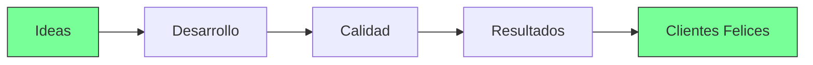

<!-- Header animado -->
<div align="center">
  
  

  ### 🚀 Desarrollador Full Stack | 🇵🇪 Perú

  
  
  
</div>

---

## 👨‍💻 Sobre mí

```yaml
Nombre: Daniel Martel
Ubicación: 🇵🇪 Perú
Rol: Desarrollador Web Full Stack
Pasión: Programación + Ensamblaje de PC
Estado: 🔭 En busca de nuevas oportunidades
```

> 💡 *"Transformando ideas en experiencias digitales excepcionales"*

---

## 🌱 Actualmente

- 🎯 Aprendiendo **NestJS** para arquitecturas backend escalables
- 🔧 Mejorando mis habilidades en **TypeScript** y patrones de diseño
- 🚀 Construyendo proyectos con **Next.js 14** y **Server Actions**

---

## 💬 Pregúntame sobre

<div align="center">
  
| Frontend | Backend | Base de Datos | Herramientas |
|----------|---------|---------------|--------------|
|  |  |  |  |
|  |  |  |  |
|  |  | |  |

</div>

---

## 🛠️ Stack Tecnológico

<p align="center">
  <a href="https://skillicons.dev">
    
  </a>
</p>

---

## 📈 Estadísticas de GitHub

<div align="center">
  
  
  
  
  
  

</div>

---

## 🚀 Portafolio y Contacto

<div align="center">

  [](https://marteldev.com)
  [](https://rxresu.me/danyel.martel/cv-definitivo)
  [](https://www.linkedin.com/in/developer-martel)
  [](mailto:danyel.martel@gmail.com)

</div>

---

## 🎯 Enfoque Profesional



> ✨ **Mi filosofía**: Código limpio, UX intuitiva y soluciones que generan impacto real.

---

<div align="center">
  
  ### 🎮 Bonus: PC Building Enthusiast
  
  
  
  
  > "Así como optimizo hardware para máximo rendimiento, optimizo código para máxima eficiencia" 💻⚡

</div>

---

<p align="center">
  <sub>Hecho con ❤️ y mucho café ☕ por <strong>Daniel Martel</strong></sub><br>
  <sup>© 2024 - Todos los derechos reservados</sup>
</p>
